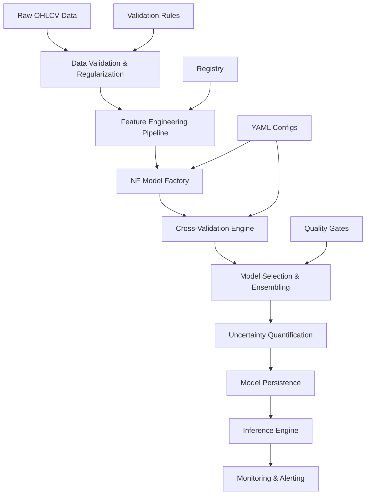
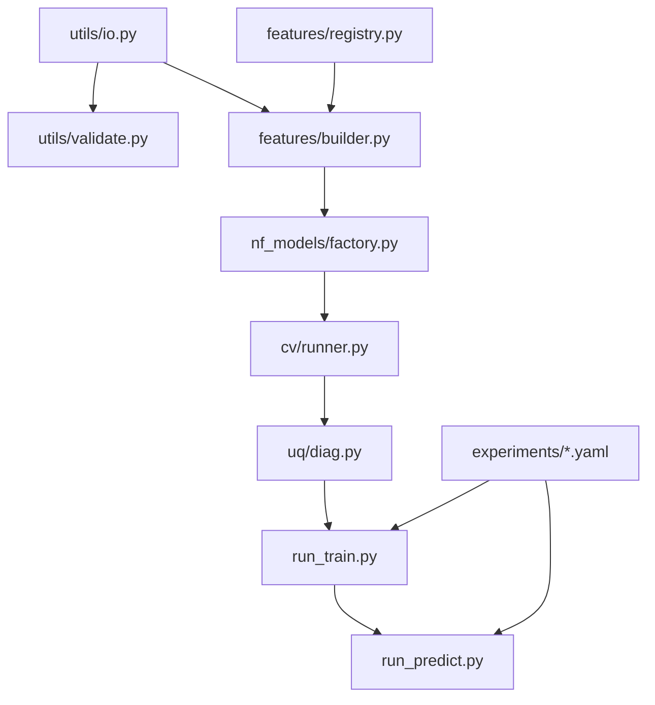

# Design Document

## Overview

This design document outlines the architecture for a comprehensive BTC intraday forecasting system built on NeuralForecast (NF). The system generates probabilistic forecasts with calibrated prediction intervals at multiple horizons (1h, 2h, 4h, 8h) using 15-minute frequency data. The design emphasizes NF-native approaches, strict data discipline, and production-ready deployment capabilities.

The system follows a modular architecture with clear separation of concerns: data processing, feature engineering, model training, uncertainty quantification, and deployment. All components are designed to prevent data leakage, ensure reproducibility, and maintain high code quality through strict LOC limits and coding standards.

## Architecture

### High-Level System Architecture



### Data Flow Architecture


### Module Dependency Graph



## Components and Interfaces

### Core Data Processing Components

#### utils/io.py (120 LOC)
**Purpose:** Core data I/O and transformation functions
**Key Functions:**
- `regularize_to_grid_utc(df: pd.DataFrame, freq: str = "15min") -> pd.DataFrame`
- `make_nf_canonical(df: pd.DataFrame, unique_id: str = "BTC-USD") -> pd.DataFrame`
- `drop_train_nans_and_winsorize(df: pd.DataFrame, winsor_q: tuple = (0.001, 0.999)) -> pd.DataFrame`
- `load_canonical_frame(path: str) -> pd.DataFrame`
- `save_parquet(df: pd.DataFrame, path: str) -> None`
- `timestamped_path(base_dir: str, stem: str, ext: str = "parquet") -> str`

**Interface Contract:**
```python
# Input: Raw OHLCV with potential gaps/irregularities
# Output: NF-ready long format ["unique_id", "ds", "y", OHLCV...]
# Guarantees: UTC EOB timestamps, no forward-filled y, deterministic
```

#### utils/validate.py (150 LOC)
**Purpose:** Data quality validation and leakage detection
**Key Functions:**
- `assert_regular_grid(df: pd.DataFrame, freq: str = "15min") -> None`
- `assert_utc_eob(df: pd.DataFrame, freq: str = "15min") -> None`
- `assert_no_forward_fill_y(df: pd.DataFrame) -> None`
- `assert_shifted(df: pd.DataFrame, hist_cols: Sequence[str]) -> None`

**Validation Logic:**
```python
# Grid validation: ds.is_monotonic_increasing and complete 15min grid
# EOB validation: all timestamps align to :00, :15, :30, :45
# Leakage detection: corr(exog_t, y_t) < corr(exog_t, y_{t+1})
```

### Feature Engineering Components

#### features/registry.py (150 LOC)
**Purpose:** Declarative feature specification registry
**Structure:**
```python
REGISTRY = {
    "indicators": [
        {"name": "rsi", "params": {"window": [7, 14, 28]}, "kind": "hist"},
        {"name": "bb_bandwidth", "params": {"window": [20], "std": [2]}, "kind": "hist"},
        # ... more indicators
    ],
    "mtf_features": [
        {"name": "sma", "params": {"window": [20, 50]}, "timeframes": ["30min", "1h", "4h"]},
        # ... more MTF features
    ],
    "calendar": [
        {"name": "minute_of_day", "kind": "futr"},
        {"name": "day_of_week", "kind": "futr"},
        {"name": "is_weekend", "kind": "futr"}
    ]
}
```

#### features/builder.py (300 LOC)
**Purpose:** Feature computation and processing pipeline
**Key Functions:**
- `build_indicators(df_ohlcv: pd.DataFrame, registry: dict) -> pd.DataFrame`
- `apply_mtf(df_ohlcv: pd.DataFrame, registry: dict) -> pd.DataFrame`
- `postprocess_shift_and_prune(df_exog: pd.DataFrame, shift: int = 1) -> pd.DataFrame`
- `select_features(df: pd.DataFrame, max_features: int = 256, min_availability: float = 0.98) -> pd.DataFrame`

**Processing Pipeline:**
```python
# 1. Compute base indicators on 15min OHLCV
# 2. Resample to higher timeframes (30min/1h/4h) with EOB alignment
# 3. Forward-fill MTF features to 15min grid
# 4. Apply central shift(1) to all hist_exog features
# 5. Select features based on availability and correlation pruning
```

### Model Training Components

#### nf_models/factory.py (200 LOC)
**Purpose:** NeuralForecast model instantiation and configuration
**Key Functions:**
- `instantiate_models(cfg: dict, hist_cols: List[str], futr_cols: List[str], stat_cols: List[str]) -> List[BaseModel]`
- `_make_loss(spec: dict) -> BaseLoss`

**Model Configuration:**
```python
# Supported models: NHITS, NBEATSx, TiDE, PatchTST
# Default parameters:
# - batch_size: 512
# - learning_rate: 1e-3
# - max_steps: 20000
# - early_stop_patience_steps: 400
# - scaler_type: "robust" (revin=True for PatchTST)
# - input_size: 1024 (2048 for PatchTST)
```

#### cv/runner.py (120 LOC)
**Purpose:** Cross-validation execution and evaluation
**Key Functions:**
- `run_cv(nf: NeuralForecast, df: pd.DataFrame, n_windows: int, step_size: int, val_size: int, refit: bool = True) -> pd.DataFrame`
- `summarize_cv(cv_df: pd.DataFrame) -> pd.DataFrame`

**CV Configuration:**
```python
# Windowing: n_windows=6 (pilot) -> 10 (final)
# Non-overlapping: step_size=h
# Validation size: val_size=4*h
# Always refit=True for realistic evaluation
```

### Uncertainty Quantification Components

#### uq/diag.py (250 LOC)
**Purpose:** Probabilistic evaluation and ensemble methods
**Key Functions:**
- `compute_coverage(df_preds: pd.DataFrame, levels: List[int] = [80, 90, 95]) -> pd.DataFrame`
- `plot_pit(insample_df: pd.DataFrame) -> Path`
- `coverage_by_vol_decile(df_preds: pd.DataFrame, df_ref_vol: pd.DataFrame) -> pd.DataFrame`
- `blend_equal(models_preds: List[pd.DataFrame]) -> pd.DataFrame`

**Diagnostic Pipeline:**
```python
# 1. Compute empirical coverage at 80/90/95 levels
# 2. Generate PIT histograms for calibration assessment
# 3. Analyze coverage by volatility regime
# 4. Implement simple equal-weight ensemble blending
```

### Workflow Orchestration

#### run_train.py (200 LOC)
**Purpose:** Training workflow orchestration
**Workflow:**
```python
# 1. Load canonical frame from data/
# 2. Build and select features (≤256)
# 3. Instantiate NF models from YAML config
# 4. Execute cross-validation with proper windowing
# 5. Compute insample diagnostics (PIT, coverage)
# 6. Generate leaderboard and select winners
# 7. Optional: final fit and save to experiments/h{h}/best/
```

#### run_predict.py (150 LOC)
**Purpose:** Inference and live prediction
**Modes:**
- Single-shot: Generate predictions for specific timestamp
- Live loop: Continuous 15-minute prediction cycle with 45s buffer

**Inference Pipeline:**
```python
# 1. Load saved NF model from experiments/h{h}/best/
# 2. Build tail features using same pipeline as training
# 3. Generate predictions with predict(level=[80,90,95])
# 4. Apply conformal adjustment if configured
# 5. Save predictions to reports/h{h}/preds_*.parquet
```

## Data Models

### Core Data Schemas

#### NF Canonical Frame
```python
{
    "unique_id": str,  # "BTC-USD"
    "ds": pd.Timestamp,  # UTC EOB timestamps
    "y": float,  # log returns: log(close_t) - log(close_{t-1})
    "open": float,
    "high": float,
    "low": float,
    "close": float,
    "volume": float,
    # ... hist_exog features (shifted by 1)
    # ... futr_exog features (calendar)
    # ... stat_exog features (if any)
}
```

#### CV Results Schema
```python
{
    "unique_id": str,
    "ds": pd.Timestamp,
    "cutoff": pd.Timestamp,
    "y": float,
    "ModelName": float,  # point prediction
    "ModelName-lo-80": float,  # 80% lower bound
    "ModelName-hi-80": float,  # 80% upper bound
    "ModelName-lo-90": float,  # 90% lower bound
    "ModelName-hi-90": float,  # 90% upper bound
    "ModelName-lo-95": float,  # 95% lower bound
    "ModelName-hi-95": float,  # 95% upper bound
}
```

#### Experiment Configuration Schema
```yaml
h: 16  # horizon in steps
n_windows: 6  # CV windows (10 for final)
step_size: 16  # non-overlapping
val_size: 64  # 4*h
refit: true
models:
  - NHITS:
      loss: {kind: studentt}
      learning_rate: 0.001
      batch_size: 512
      max_steps: 20000
      early_stop_patience_steps: 400
  - PatchTST:
      loss: {kind: studentt}
      learning_rate: 0.0005
      batch_size: 512
      revin: true
      input_size: 2048
```

## Error Handling

### Validation Error Handling
```python
class DataValidationError(Exception):
    """Raised when data validation fails"""
    pass

class LeakageDetectionError(Exception):
    """Raised when potential leakage is detected"""
    pass

# Error handling strategy:
# 1. Fail fast on validation errors
# 2. Log detailed error context
# 3. Provide specific remediation guidance
# 4. Never proceed with invalid data
```

### Training Error Handling
```python
# GPU OOM handling:
# 1. Reduce batch_size: 512 -> 256 -> 128
# 2. Reduce input_size for PatchTST
# 3. Fall back to CPU if necessary
# 4. Skip PatchTST if memory constraints persist

# Training instability handling:
# 1. Reduce learning_rate: 1e-3 -> 5e-4 -> 1e-4
# 2. Increase early_stop_patience_steps
# 3. Apply stronger winsorization
# 4. Remove problematic features
```

### Live Inference Error Handling
```python
# Data availability errors:
# 1. Skip cycle if last bar incomplete
# 2. Log missing data incidents
# 3. Maintain data provenance tracking
# 4. Alert on sustained data issues

# Model loading errors:
# 1. Attempt rollback to previous model
# 2. Fall back to simpler model if available
# 3. Generate alerts for manual intervention
# 4. Maintain service availability
```

## Testing Strategy

### Unit Testing Strategy
```python
# Data validation tests:
# - Test assert functions with synthetic counterexamples
# - Verify grid regularity and EOB alignment
# - Test leakage detection with known violations

# Feature engineering tests:
# - Test MTF alignment with toy examples
# - Verify shift(1) application
# - Test feature selection logic

# Model factory tests:
# - Test model instantiation with various configs
# - Verify exog list wiring
# - Test loss function creation
```

### Integration Testing Strategy
```python
# End-to-end pipeline tests:
# - Raw OHLCV -> NF canonical frame
# - Feature building -> model training
# - CV execution -> model selection
# - Inference pipeline -> prediction output

# Smoke tests:
# - Mini-CV on fixed data slice
# - Save/load round-trip verification
# - Prediction consistency checks
```

### Performance Testing Strategy
```python
# Memory usage tests:
# - Monitor GPU memory during training
# - Test batch size scaling
# - Verify graceful degradation

# Latency tests:
# - Measure inference time per horizon
# - Test live loop timing with buffer
# - Verify SLA compliance
```

## Deployment Architecture

### Training Environment
```python
# Requirements:
# - GPU with ≥8GB memory (for PatchTST)
# - 32GB+ system RAM
# - Fast storage for data and artifacts
# - Python 3.8+ with NeuralForecast dependencies

# Artifact storage:
# - experiments/h{h}/cv_results.parquet
# - experiments/h{h}/metrics.csv
# - experiments/h{h}/best/ (model saves)
# - reports/h{h}/ (diagnostics)
```

### Production Inference Environment
```python
# Requirements:
# - GPU optional (CPU acceptable for inference)
# - 16GB+ system RAM
# - Reliable 15-minute data feed
# - Monitoring and alerting infrastructure

# Live loop configuration:
# - 15-minute trigger with 45s buffer
# - Graceful degradation on failures
# - Automatic rollback capabilities
# - Performance monitoring
```

### Monitoring and Alerting
```python
# Coverage monitoring:
# - Track 7-day rolling empirical coverage
# - Alert on ±3pp deviation from nominal
# - Monitor by volatility regime

# Performance monitoring:
# - Track sCRPS degradation (>3% vs baseline)
# - Monitor PSI for distribution shift
# - Track inference latency and memory usage

# Operational monitoring:
# - Data feed health and completeness
# - Model loading and prediction success
# - System resource utilization
```