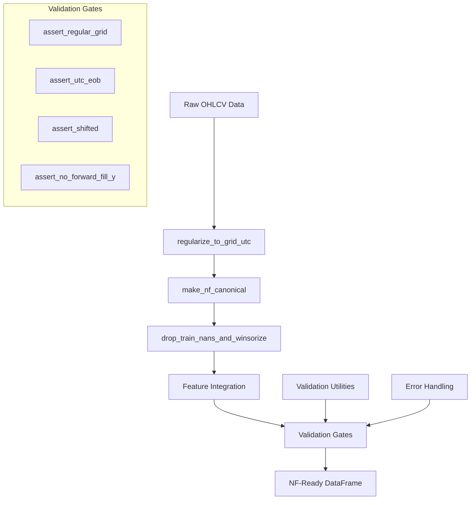

# Design Document

## Overview

The Data Processing and Validation component serves as the foundational layer of the BTC forecasting system, ensuring data quality, preventing leakage, and creating canonical NeuralForecast-compatible data frames. This component implements a robust pipeline that transforms raw OHLCV data into validated, regularized time series data suitable for neural forecasting models.

The design follows a strict assembly path: raw data → regularization → canonical frame creation → validation → feature integration. Each step includes comprehensive validation to catch data quality issues early and prevent downstream failures.

## Architecture

### High-Level Data Flow



### Component Architecture

The system is organized into two main utility modules:

1. **utils/validate.py** - Validation functions and assertion utilities
2. **utils/io.py** - Data processing, loading, and transformation functions

### Key Design Principles

1. **NeuralForecast Schema Compliance** - All data must conform to NF's long-format schema: `["unique_id", "ds", "y", <exog...>]`
2. **UTC End-of-Bar Discipline** - All timestamps use UTC timezone with end-of-bar semantics on 15-minute boundaries
3. **Leakage Prevention** - Strict temporal discipline with validation to prevent future information contamination
4. **Data Quality Gates** - Comprehensive validation at each processing step
5. **Graceful Error Handling** - Clear, actionable error messages with diagnostic information

## Components and Interfaces

### Data Processing Components (utils/io.py)

#### regularize_to_grid_utc Function

**Purpose**: Create a complete UTC time grid with proper end-of-bar alignment

**Interface**:
```python
def regularize_to_grid_utc(df_ohlcv: pd.DataFrame, freq: str = "15min") -> pd.DataFrame
```

**Implementation Strategy**:
- Convert timestamps to UTC timezone with proper datetime64[ns] format
- Snap timestamps to 15-minute boundaries using `dt.floor(freq)`
- Create complete date range from min to max timestamp
- Merge original data with complete grid, filling gaps with NaN
- Preserve OHLCV columns: ["open", "high", "low", "close", "volume"]

**Error Handling**:
- Raise ValueError if no timestamp column found ("ds" or "timestamp")
- Handle timezone conversion gracefully with proper UTC localization

#### make_nf_canonical Function

**Purpose**: Transform OHLCV data into NeuralForecast canonical schema

**Interface**:
```python
def make_nf_canonical(df_ohlcv_15m: pd.DataFrame, unique_id: str = "BTC-USD") -> pd.DataFrame
```

**Implementation Strategy**:
- Call regularize_to_grid_utc to ensure proper time grid
- Compute log returns: `y = np.log(df["close"]).diff()`
- Create canonical schema: `["unique_id", "ds", "y", "open", "high", "low", "close", "volume"]`
- Set unique_id to "BTC-USD" for all rows
- Preserve original OHLCV data for feature engineering

**Error Handling**:
- Raise ValueError if "close" column missing
- Handle edge cases in log return computation (zero/negative prices)

#### drop_train_nans_and_winsorize Function

**Purpose**: Apply winsorization for training stability while preserving evaluation data

**Interface**:
```python
def drop_train_nans_and_winsorize(nf_df: pd.DataFrame, lower_q=0.001, upper_q=0.999) -> pd.DataFrame
```

**Implementation Strategy**:
- Compute quantiles on non-NaN y values only
- Create y_train column with clipped values using `df["y"].clip(lower=ql, upper=qu)`
- Preserve original y column for evaluation
- Return DataFrame with both y and y_train columns

**Data Integrity**:
- Never modify original y values for evaluation
- Only apply winsorization to training subset
- Maintain NaN values where appropriate

### Validation Components (utils/validate.py)

#### assert_regular_grid Function

**Purpose**: Validate 15-minute time grid completeness and monotonicity

**Interface**:
```python
def assert_regular_grid(df: pd.DataFrame, freq: str = "15min") -> None
```

**Implementation Strategy**:
- Extract DatetimeIndex from df["ds"]
- Assert monotonic increasing: `ds.is_monotonic_increasing`
- Create expected date range: `pd.date_range(ds.min(), ds.max(), freq=freq, tz="UTC")`
- Assert UTC timezone: `(ds.tz is not None) and (str(ds.tz) == "UTC")`
- Assert length match: `len(ds) == len(expected)`

**Error Conditions**:
- Non-monotonic timestamps
- Missing or extra bars vs regular grid
- Non-UTC timezone
- Irregular frequency

#### assert_utc_eob Function

**Purpose**: Validate UTC end-of-bar timestamp alignment

**Interface**:
```python
def assert_utc_eob(df: pd.DataFrame, freq: str = "15min") -> None
```

**Implementation Strategy**:
- Extract DatetimeIndex from df["ds"]
- Check minute alignment: `all(getattr(ts, "minute") % 15 == 0 for ts in ds)`
- Validate end-of-bar semantics on 15-minute boundaries

**Error Conditions**:
- Timestamps not aligned to 15-minute boundaries
- Non-end-of-bar timestamps detected

#### assert_shifted Function

**Purpose**: Detect potential data leakage using correlation analysis

**Interface**:
```python
def assert_shifted(df: pd.DataFrame, hist_cols: Sequence[str]) -> None
```

**Implementation Strategy**:
- Extract y values and create lead-1 series: `y_lead1 = np.roll(y, -1)`
- For each historical column, compute correlations:
  - Contemporaneous: `corr(x, y)`
  - Next-step: `corr(x, y_lead1)`
- Assert contemporaneous correlation < next-step correlation
- Use NaN-safe correlation computation

**Leakage Detection Logic**:
- If a feature has stronger correlation with current y than future y, it suggests proper shifting
- If correlation with future y is stronger, it indicates potential leakage

#### assert_no_forward_fill_y Function

**Purpose**: Prevent target variable forward-filling

**Interface**:
```python
def assert_no_forward_fill_y(df: pd.DataFrame) -> None
```

**Implementation Strategy**:
- Check rows where 'close' is NaN should have y as NaN
- Identify violations: `bad = df["close"].isna() & df["y"].notna()`
- Assert no violations exist

**Data Integrity Check**:
- Ensures missing price data corresponds to missing target data
- Prevents artificial target values from forward-filling

### Utility Functions (utils/io.py)

#### load_canonical_frame Function

**Purpose**: Load and validate stored canonical frames

**Interface**:
```python
def load_canonical_frame(path: str) -> pd.DataFrame
```

**Implementation Strategy**:
- Load parquet file using pandas
- Enforce canonical schema if needed
- Return validated DataFrame

#### save_parquet Function

**Purpose**: Save DataFrames with proper directory management

**Interface**:
```python
def save_parquet(df: pd.DataFrame, path: str) -> None
```

**Implementation Strategy**:
- Create parent directories: `Path(path).parent.mkdir(parents=True, exist_ok=True)`
- Save without index: `df.to_parquet(path, index=False)`

#### timestamped_path Function

**Purpose**: Generate timestamped file paths for versioning

**Interface**:
```python
def timestamped_path(base_dir: str, stem: str, ext: str = "parquet") -> str
```

**Implementation Strategy**:
- Generate UTC timestamp: `datetime.now(timezone.utc).strftime("%Y%m%dT%H%M%SZ")`
- Create path with timestamp: `{stem}_{ts}.{ext}`
- Ensure parent directory exists

## Data Models

### Input Data Schema

**Raw OHLCV Data**:
```python
{
    "timestamp": datetime64[ns],  # or "ds"
    "open": float64,
    "high": float64,
    "low": float64,
    "close": float64,
    "volume": float64
}
```

### Canonical NeuralForecast Schema

**NF Long Format**:
```python
{
    "unique_id": str,           # "BTC-USD"
    "ds": datetime64[ns, UTC],  # End-of-bar timestamps
    "y": float64,               # Log returns
    "open": float64,            # Preserved for features
    "high": float64,            # Preserved for features
    "low": float64,             # Preserved for features
    "close": float64,           # Preserved for features
    "volume": float64           # Preserved for features
}
```

### Processed Training Data

**Training-Ready Schema**:
```python
{
    "unique_id": str,
    "ds": datetime64[ns, UTC],
    "y": float64,               # Original for evaluation
    "y_train": float64,         # Winsorized for training
    "open": float64,
    "high": float64,
    "low": float64,
    "close": float64,
    "volume": float64,
    # ... additional exogenous features
}
```

## Error Handling

### Error Classification

1. **Data Quality Errors** (ValueError)
   - Missing required columns
   - Invalid data types
   - Corrupted timestamps

2. **Validation Errors** (AssertionError)
   - Grid irregularities
   - Timezone mismatches
   - Leakage detection
   - Forward-fill violations

3. **Processing Errors** (RuntimeError)
   - File I/O failures
   - Memory constraints
   - Computation failures

### Error Handling Strategy

#### Validation Functions
- Use AssertionError for validation failures
- Include specific diagnostic information in error messages
- Provide actionable guidance for fixing issues

#### Processing Functions
- Use ValueError for input validation issues
- Use RuntimeError for processing failures
- Include context about the failed operation

#### Example Error Messages
```python
# Grid validation failure
AssertionError: "missing or extra bars vs regular grid: expected 1440 bars, got 1438"

# Leakage detection
AssertionError: "Potential leakage in rsi_14: fix shift(1) - corr(x,y)=0.85 > corr(x,y_lead1)=0.23"

# Forward-fill detection
AssertionError: "Detected non-NaN y where close is NaN (forbidden forward-fill of target)"
```

## Testing Strategy

### Unit Testing Approach

1. **Validation Function Tests**
   - Test each assertion with valid and invalid data
   - Verify error messages are informative
   - Test edge cases (empty data, single row, etc.)

2. **Processing Function Tests**
   - Test data transformations with known inputs/outputs
   - Verify schema compliance
   - Test error handling paths

3. **Integration Tests**
   - Test complete assembly path
   - Verify end-to-end data flow
   - Test with realistic BTC data

### Test Data Strategy

1. **Synthetic Data**
   - Generate regular 15-minute grids
   - Create data with known gaps/irregularities
   - Simulate various error conditions

2. **Real Data Samples**
   - Use small BTC datasets for integration testing
   - Test with actual market data irregularities
   - Validate against known good outputs

### Performance Testing

1. **Memory Usage**
   - Test with large datasets (1M+ rows)
   - Monitor memory consumption during processing
   - Verify garbage collection effectiveness

2. **Processing Speed**
   - Benchmark key functions
   - Identify bottlenecks in the assembly path
   - Optimize critical sections

## Implementation Considerations

### Dependencies

**Required Libraries**:
- pandas >= 1.5.0 (DataFrame operations, datetime handling)
- numpy >= 1.21.0 (numerical computations, log returns)
- pathlib (file path management)
- datetime (timezone handling)
- typing (type hints)

### Memory Management

1. **Large Dataset Handling**
   - Process data in chunks if memory constrained
   - Use efficient pandas operations (vectorized)
   - Minimize data copying during transformations

2. **Garbage Collection**
   - Explicitly delete intermediate DataFrames
   - Use context managers for file operations
   - Monitor memory usage in long-running processes

### Performance Optimization

1. **Vectorized Operations**
   - Use pandas/numpy vectorized functions
   - Avoid Python loops for data processing
   - Leverage pandas' optimized datetime operations

2. **Efficient Data Types**
   - Use appropriate dtypes (float32 vs float64)
   - Optimize categorical data representation
   - Minimize string operations

### Configuration Management

1. **Parameterization**
   - Make frequency configurable ("15min" default)
   - Allow customizable winsorization quantiles
   - Support different unique_id formats

2. **Validation Thresholds**
   - Configurable correlation thresholds for leakage detection
   - Adjustable tolerance for timestamp alignment
   - Customizable error message verbosity

This design provides a robust, well-tested foundation for the BTC forecasting system's data processing needs, ensuring data quality and preventing common pitfalls in time series forecasting.