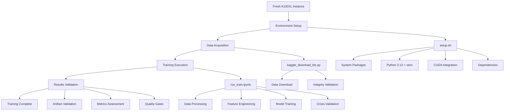
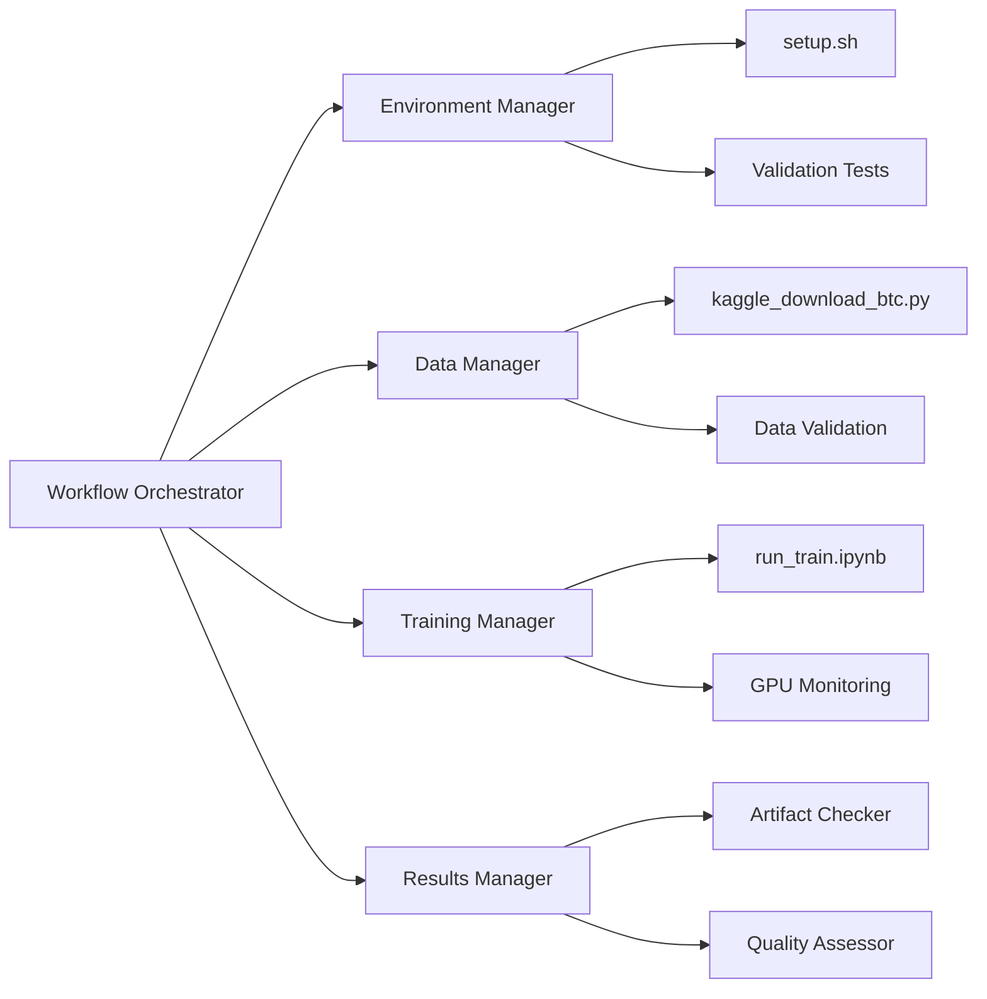

# Design Document

## Overview

The GPU Training Workflow design provides a comprehensive, practical framework for executing the complete BTC forecasting training pipeline on Thunder Compute A100XL instances. The design leverages existing, fully-implemented components (setup.sh, kaggle_download_btc.py, run_train.ipynb) to create a seamless, autonomous training experience with robust error handling and performance optimization.

## Architecture

### Core Workflow Architecture



### Component Integration



## Components and Interfaces

### Workflow Orchestrator

**Purpose:** Central coordinator for the complete training workflow
**Key Functions:**
- Sequential step execution with dependency validation
- Progress tracking and time estimation
- Error handling and recovery coordination
- Resource monitoring and optimization

**Interface:**
```python
class WorkflowOrchestrator:
    def execute_training_pipeline(self, horizon: str) -> TrainingResult:
        """Execute complete training pipeline for specified horizon."""
        
    def validate_step_completion(self, step: WorkflowStep) -> ValidationResult:
        """Validate successful completion of workflow step."""
        
    def handle_step_failure(self, step: WorkflowStep, error: Exception) -> RecoveryAction:
        """Handle step failures with appropriate recovery procedures."""
        
    def monitor_progress(self) -> ProgressStatus:
        """Monitor and report training progress."""
```

### Environment Manager

**Purpose:** Handles complete environment setup and validation
**Key Functions:**
- System package installation and configuration
- Python environment creation with dependency management
- CUDA integration and GPU validation
- Project deployment and structure creation

**Interface:**
```python
class EnvironmentManager:
    def setup_environment(self) -> SetupResult:
        """Execute setup.sh and validate environment."""
        
    def validate_dependencies(self) -> DependencyStatus:
        """Validate all critical imports and GPU access."""
        
    def create_project_structure(self) -> StructureResult:
        """Create required directories and deploy project."""
        
    def generate_setup_report(self) -> SetupReport:
        """Generate comprehensive setup validation report."""
```

### Data Manager

**Purpose:** Manages data acquisition, validation, and processing
**Key Functions:**
- Kaggle data download with integrity validation
- Data quality assessment and validation gates
- Processing pipeline execution and monitoring
- Error detection and recovery procedures

**Interface:**
```python
class DataManager:
    def acquire_data(self) -> DataAcquisitionResult:
        """Download and validate Bitcoin historical data."""
        
    def validate_data_integrity(self, file_path: str) -> IntegrityResult:
        """Validate file size, row count, and data quality."""
        
    def execute_processing_pipeline(self) -> ProcessingResult:
        """Execute complete data assembly path with validation."""
        
    def handle_data_errors(self, error: DataError) -> RecoveryProcedure:
        """Handle data-related errors with recovery procedures."""
```

### Training Manager

**Purpose:** Orchestrates model training execution with GPU optimization
**Key Functions:**
- Notebook cell execution with guidance
- GPU utilization monitoring and optimization
- Cross-validation execution and progress tracking
- Artifact generation and management

**Interface:**
```python
class TrainingManager:
    def configure_training(self, horizon: str) -> TrainingConfig:
        """Configure training parameters for specified horizon."""
        
    def execute_notebook_cells(self, config: TrainingConfig) -> ExecutionResult:
        """Execute run_train.ipynb with cell-by-cell guidance."""
        
    def monitor_gpu_utilization(self) -> GPUStatus:
        """Monitor GPU utilization and memory usage."""
        
    def manage_artifacts(self, horizon: str) -> ArtifactResult:
        """Manage training artifacts and model persistence."""
```

### Results Manager

**Purpose:** Validates training results and assesses model quality
**Key Functions:**
- Artifact validation and completeness checking
- Metrics interpretation and quality assessment
- Leaderboard generation and model ranking
- Quality gate enforcement and reporting

**Interface:**
```python
class ResultsManager:
    def validate_artifacts(self, experiment_dir: str) -> ArtifactValidation:
        """Validate presence and integrity of training artifacts."""
        
    def assess_model_quality(self, metrics: Dict) -> QualityAssessment:
        """Assess model quality against acceptance criteria."""
        
    def generate_leaderboard(self, cv_results: pd.DataFrame) -> Leaderboard:
        """Generate model performance leaderboard."""
        
    def create_training_report(self, horizon: str) -> TrainingReport:
        """Create comprehensive training completion report."""
```

## Data Models

### Workflow Configuration

```python
@dataclass
class WorkflowConfig:
    """Configuration for complete training workflow."""
    horizon: str  # h4, h8, h16, h32
    instance_type: str  # A100XL
    batch_size: int  # 512 default, 256 fallback
    memory_config: str  # max_split_size_mb:512
    timeout_minutes: int  # Per-step timeout
    retry_attempts: int  # Error recovery attempts
```

### Training Execution State

```python
@dataclass
class TrainingState:
    """Current state of training execution."""
    current_step: WorkflowStep
    progress_percentage: float
    gpu_utilization: float
    memory_usage: float
    estimated_completion: datetime
    artifacts_generated: List[str]
    errors_encountered: List[TrainingError]
```

### Quality Assessment Result

```python
@dataclass
class QualityAssessment:
    """Results of model quality assessment."""
    scrps_score: float  # Primary metric
    coverage_80: float  # 80% prediction interval coverage
    coverage_90: float  # 90% prediction interval coverage
    coverage_95: float  # 95% prediction interval coverage
    model_ranking: List[ModelRank]
    acceptance_status: AcceptanceStatus
    recommendations: List[str]
```

## Error Handling Strategy

### Environment Setup Errors

**Error Categories:**
- System package installation failures
- Python environment creation issues
- CUDA driver/toolkit problems
- Dependency installation conflicts

**Recovery Procedures:**
```python
def handle_setup_error(error: SetupError) -> RecoveryAction:
    if error.type == "dependency_conflict":
        return clean_environment_and_retry()
    elif error.type == "cuda_driver":
        return reinstall_cuda_drivers()
    elif error.type == "python_version":
        return install_correct_python_version()
    else:
        return escalate_to_manual_intervention()
```

### Data Acquisition Errors

**Error Categories:**
- Network connectivity issues
- Kaggle authentication problems
- File corruption or incomplete downloads
- Data validation failures

**Recovery Procedures:**
```python
def handle_data_error(error: DataError) -> RecoveryAction:
    if error.type == "network_timeout":
        return retry_with_exponential_backoff()
    elif error.type == "authentication":
        return prompt_for_kaggle_credentials()
    elif error.type == "corruption":
        return delete_and_redownload()
    else:
        return use_cached_data_if_available()
```

### Training Execution Errors

**Error Categories:**
- GPU out-of-memory errors
- Model convergence failures
- Notebook execution interruptions
- Configuration validation errors

**Recovery Procedures:**
```python
def handle_training_error(error: TrainingError) -> RecoveryAction:
    if error.type == "gpu_oom":
        return reduce_batch_size_and_retry()
    elif error.type == "convergence":
        return adjust_learning_rate_and_retry()
    elif error.type == "interruption":
        return resume_from_checkpoint()
    else:
        return restart_training_from_last_stable_point()
```

## Performance Optimization

### A100XL-Specific Optimizations

```python
# GPU Memory Configuration
PYTORCH_CUDA_ALLOC_CONF = "max_split_size_mb:512"
CUDA_LAUNCH_BLOCKING = "0"

# Model-Specific Batch Sizes
BATCH_SIZES = {
    "NHITS": 512,      # ~45GB memory usage
    "NBEATSx": 512,    # ~50GB memory usage
    "TiDE": 512,       # ~40GB memory usage
    "PatchTST": 256    # ~60GB memory usage (larger input)
}

# Memory Monitoring Thresholds
GPU_MEMORY_WARNING = 0.85  # 85% usage warning
GPU_MEMORY_CRITICAL = 0.95  # 95% usage critical
```

### Performance Monitoring

```python
class PerformanceMonitor:
    def monitor_gpu_utilization(self) -> GPUMetrics:
        """Monitor real-time GPU utilization and memory."""
        
    def track_training_progress(self) -> ProgressMetrics:
        """Track training progress and time estimates."""
        
    def detect_performance_issues(self) -> List[PerformanceIssue]:
        """Detect and report performance bottlenecks."""
        
    def optimize_resource_usage(self) -> OptimizationResult:
        """Apply automatic performance optimizations."""
```

## Testing Strategy

### Integration Testing

**End-to-End Workflow Testing:**
```python
def test_complete_workflow():
    """Test complete workflow from setup to results."""
    # Setup environment
    setup_result = execute_setup()
    assert setup_result.success
    
    # Acquire data
    data_result = acquire_data()
    assert data_result.integrity_valid
    
    # Execute training
    training_result = execute_training("h4")
    assert training_result.artifacts_complete
    
    # Validate results
    quality_result = assess_quality(training_result)
    assert quality_result.meets_acceptance_criteria
```

**Component Integration Testing:**
```python
def test_component_integration():
    """Test integration between workflow components."""
    orchestrator = WorkflowOrchestrator()
    env_manager = EnvironmentManager()
    data_manager = DataManager()
    training_manager = TrainingManager()
    results_manager = ResultsManager()
    
    # Test component communication
    assert orchestrator.can_communicate_with(env_manager)
    assert data_manager.can_provide_data_to(training_manager)
    assert training_manager.can_provide_results_to(results_manager)
```

### Performance Testing

**GPU Utilization Testing:**
```python
def test_gpu_utilization():
    """Test optimal GPU utilization during training."""
    monitor = PerformanceMonitor()
    
    # Start training
    training_manager.start_training("h4")
    
    # Monitor utilization
    while training_manager.is_training():
        metrics = monitor.get_gpu_metrics()
        assert metrics.utilization > 0.8  # >80% utilization
        assert metrics.memory_usage < 0.95  # <95% memory
```

## Implementation Phases

### Phase 1: Core Workflow Implementation
1. **Workflow Orchestrator**: Implement central coordination logic
2. **Step Validation**: Create step completion and dependency validation
3. **Error Handling**: Implement basic error detection and recovery
4. **Progress Tracking**: Add progress monitoring and time estimation

### Phase 2: Component Integration
1. **Environment Manager**: Integrate setup.sh execution and validation
2. **Data Manager**: Integrate kaggle_download_btc.py and data validation
3. **Training Manager**: Integrate run_train.ipynb execution and monitoring
4. **Results Manager**: Integrate artifact validation and quality assessment

### Phase 3: Performance Optimization
1. **GPU Monitoring**: Implement real-time GPU utilization tracking
2. **Memory Management**: Add memory optimization and leak detection
3. **Batch Size Optimization**: Implement dynamic batch size adjustment
4. **Performance Tuning**: Add A100XL-specific optimizations

### Phase 4: Quality Assurance
1. **Integration Testing**: Comprehensive end-to-end testing
2. **Error Recovery Testing**: Test all error scenarios and recovery procedures
3. **Performance Validation**: Validate GPU utilization and training times
4. **Documentation**: Complete user guides and troubleshooting procedures

## Quality Gates

### Environment Setup Gates
- All critical imports successful
- GPU accessibility confirmed (A100XL with 80GB VRAM)
- Virtual environment created and activated
- Setup report generated with no critical issues

### Data Quality Gates
- File integrity validated (size, row count, date range)
- All validation gates passed (regular grid, UTC EOB, no leakage, no forward-fill)
- Data processing pipeline completed successfully
- Canonical format created and validated

### Training Quality Gates
- Model instantiation successful for all 4 models
- Cross-validation completed for all 6 windows
- GPU utilization maintained >80% during training
- All artifacts generated and saved properly

### Results Quality Gates
- sCRPS scores within acceptable range (<0.12)
- Coverage percentages within ±2% tolerance
- Model leaderboard generated successfully
- Training report created with comprehensive metrics

This design provides a robust, practical framework for executing the complete BTC forecasting training workflow on Thunder Compute A100XL instances with comprehensive error handling, performance optimization, and quality assurance.