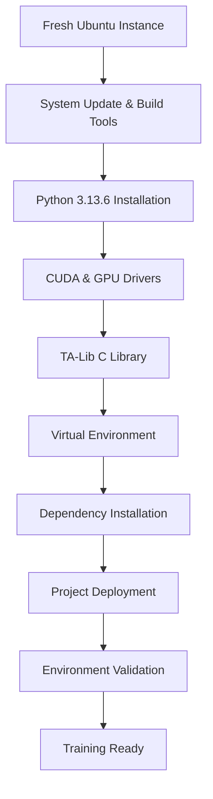
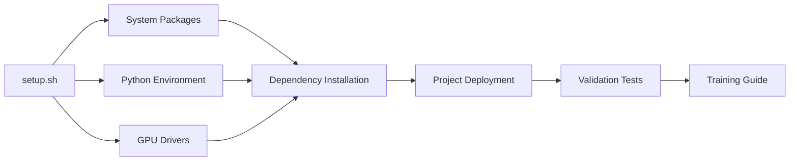

# Design Document

## Overview

This design document outlines a practical, streamlined approach for setting up the completed BTC forecasting system (v0.5.1) on a fresh Thunder Compute instance. The design focuses on simplicity and speed - creating a single setup script and training guide that gets the A100XL environment ready for immediate model training. Since all system components are already implemented and tested, this design avoids over-engineering and focuses on deployment essentials.

## Architecture

### Setup Flow Architecture



### Component Dependencies



## Components and Interfaces

### Core Setup Script (setup.sh)

**Purpose:** Single executable script that handles complete environment setup
**Key Functions:**
- System package installation and updates
- Python 3.13.6 installation with virtual environment
- CUDA driver and toolkit installation
- TA-Lib C library compilation/installation
- Python dependency installation in correct order
- Project deployment and directory structure creation
- Environment validation and testing

**Interface:**
```bash
# Simple execution
./setup.sh

# With options
./setup.sh --skip-cuda    # Skip CUDA installation
./setup.sh --test-only    # Run validation tests only
./setup.sh --clean        # Clean previous installation
```

### Dependency Installation Module

**Purpose:** Handle Python package installation in the critical order specified in dependencies.yaml
**Installation Sequence:**
```bash
# Critical order from dependencies.yaml
pip install numpy==2.3.2
pip install pandas==2.3.1 pyarrow==20.0.0
pip install torch==2.8.0 pytorch-lightning==2.5.3
pip install neuralforecast==3.0.2
pip install scikit-learn==1.7.1 statsmodels==0.14.5
pip install TA-Lib==0.6.5  # After C library
pip install -r requirements.txt  # Remaining packages
```

### Project Deployment Module

**Purpose:** Deploy the complete implemented system and verify all components
**Key Operations:**
- Clone/copy repository to Thunder Compute instance
- Create required directory structure (data/, experiments/, reports/)
- Verify all implemented modules are present and importable
- Run basic validation tests on key components

**Directory Structure Created:**
```
/home/ubuntu/Neural-Forecast/
├── data/
│   ├── raw/
│   └── processed/
├── experiments/
│   ├── h4/
│   ├── h8/
│   ├── h16/
│   └── h32/
├── reports/
├── utils/          # Implemented
├── features/       # Implemented
├── nf_models/      # Implemented
├── cv/            # Implemented
├── uq/            # Implemented
├── run_train.py   # Implemented
└── run_predict.py # Implemented
```

### Environment Validation Module

**Purpose:** Comprehensive testing to ensure environment is ready for training
**Validation Tests:**
```python
# Critical import tests
import pandas, numpy, torch, neuralforecast
import talib, vectorbt, freqtrade

# GPU validation
assert torch.cuda.is_available()
assert torch.cuda.get_device_name(0) == "NVIDIA A100-SXM4-80GB"

# Project module validation
from utils.validate import assert_regular_grid
from features.builder import build_indicators
from nf_models.factory import instantiate_models
from cv.runner import run_cv

# Pipeline smoke test
# Run minimal data processing and model instantiation
```

## Data Models

### Setup Configuration

```yaml
# setup_config.yaml
python_version: "3.13.6"
cuda_version: "12.2"
project_path: "/home/ubuntu/Neural-Forecast"
venv_path: ".venv"

# A100XL optimizations
gpu_memory: "80GB"
optimal_batch_size: 512
fallback_batch_size: 256
memory_config: "max_split_size_mb:512"

# Validation settings
test_timeout: 300
retry_attempts: 3
```

### Training Guide Template

```markdown
# Thunder Compute Training Guide

## Quick Start Commands

# Train 1-hour horizon (h4)
python run_train.py --horizon h4 --batch-size 512

# Train all horizons
for h in h4 h8 h16 h32; do
    python run_train.py --horizon $h --batch-size 512
done

# Monitor GPU usage
watch -n 1 nvidia-smi

## A100XL Optimizations
- Batch size: 512 (can go up to 1024 for smaller models)
- Memory config: PYTORCH_CUDA_ALLOC_CONF=max_split_size_mb:512
- Expected training time: ~2-4 hours per horizon
```

## Implementation Strategy

### Setup Script Structure

```bash
#!/bin/bash
set -e  # Exit on error

# Configuration
PYTHON_VERSION="3.13.6"
PROJECT_DIR="/home/ubuntu/Neural-Forecast"
VENV_DIR=".venv"

# Functions
install_system_packages() {
    sudo apt update && sudo apt upgrade -y
    sudo apt install -y build-essential git curl wget
    sudo add-apt-repository ppa:deadsnakes/ppa -y
}

install_python() {
    sudo apt install -y python3.13 python3.13-dev python3.13-venv
    curl -sS https://bootstrap.pypa.io/get-pip.py | python3.13
}

install_cuda() {
    # Install NVIDIA drivers and CUDA toolkit
    sudo apt install -y nvidia-driver-535
    # Add CUDA repository and install toolkit
}

install_talib() {
    # Try apt first, compile from source if needed
    sudo apt install -y libta-lib-dev || compile_talib_from_source
}

install_dependencies() {
    python -m venv $VENV_DIR
    source $VENV_DIR/bin/activate
    
    # Critical order installation
    pip install numpy==2.3.2
    pip install pandas==2.3.1 pyarrow==20.0.0
    pip install torch==2.8.0 pytorch-lightning==2.5.3
    pip install neuralforecast==3.0.2
    pip install scikit-learn==1.7.1
    pip install TA-Lib==0.6.5
    pip install -r requirements.txt
}

deploy_project() {
    # Clone or copy project
    # Create directory structure
    # Verify all modules present
}

validate_environment() {
    source $VENV_DIR/bin/activate
    python -c "import torch; assert torch.cuda.is_available()"
    python -c "from utils.validate import assert_regular_grid"
    # Additional validation tests
}

# Main execution
main() {
    echo "Setting up Thunder Compute for BTC Forecasting..."
    install_system_packages
    install_python
    install_cuda
    install_talib
    install_dependencies
    deploy_project
    validate_environment
    echo "Setup complete! See TRAINING_GUIDE.md for usage."
}

main "$@"
```

### Error Handling Strategy

```bash
# Robust error handling
handle_error() {
    echo "ERROR: $1"
    echo "Check setup_error.log for details"
    echo "Run with --debug for verbose output"
    exit 1
}

# Retry logic for network operations
retry_command() {
    local cmd="$1"
    local max_attempts=3
    local attempt=1
    
    while [ $attempt -le $max_attempts ]; do
        if eval "$cmd"; then
            return 0
        fi
        echo "Attempt $attempt failed, retrying..."
        ((attempt++))
        sleep 5
    done
    
    handle_error "Command failed after $max_attempts attempts: $cmd"
}
```

## Testing Strategy

### Validation Test Suite

```python
# validation_tests.py
import sys
import torch
import pandas as pd
import numpy as np

def test_gpu_access():
    """Test A100XL GPU is accessible"""
    assert torch.cuda.is_available(), "CUDA not available"
    gpu_name = torch.cuda.get_device_name(0)
    assert "A100" in gpu_name, f"Expected A100, got {gpu_name}"
    
    # Test memory allocation
    x = torch.randn(1000, 1000, device='cuda')
    assert x.device.type == 'cuda', "GPU tensor creation failed"

def test_critical_imports():
    """Test all critical packages import correctly"""
    try:
        import neuralforecast
        import talib
        import vectorbt
        from utils.validate import assert_regular_grid
        from nf_models.factory import instantiate_models
    except ImportError as e:
        raise AssertionError(f"Critical import failed: {e}")

def test_pipeline_smoke():
    """Run minimal pipeline test"""
    # Create synthetic data
    dates = pd.date_range('2024-01-01', periods=100, freq='15min')
    df = pd.DataFrame({
        'unique_id': 'BTC-USD',
        'ds': dates,
        'y': np.random.randn(100) * 0.01
    })
    
    # Test validation functions
    from utils.validate import assert_regular_grid
    assert_regular_grid(df, "15min")

if __name__ == "__main__":
    test_gpu_access()
    test_critical_imports()
    test_pipeline_smoke()
    print("All validation tests passed!")
```

## Deployment Architecture

### Thunder Compute Specifications

```yaml
# Instance specs
gpu: "A100XL (80GB VRAM)"
cpu: "8 vCPUs"
ram: "64GB"
os: "Ubuntu (fresh install)"
storage: "Fast SSD"

# Optimizations for A100XL
batch_sizes:
  NHITS: 512
  NBEATSx: 512
  TiDE: 512
  PatchTST: 256  # Larger memory footprint

memory_settings:
  PYTORCH_CUDA_ALLOC_CONF: "max_split_size_mb:512"
  CUDA_LAUNCH_BLOCKING: "0"
  
training_estimates:
  h4: "2-3 hours"
  h8: "2-3 hours" 
  h16: "3-4 hours"
  h32: "3-4 hours"
```

### File Organization

```
thunder-compute-setup/
├── setup.sh              # Main setup script
├── validation_tests.py   # Environment validation
├── TRAINING_GUIDE.md     # User guide with commands
├── cleanup.sh            # Cleanup script for failures
└── requirements_check.py # Verify all packages installed
```

This design provides a practical, no-nonsense approach to getting the completed BTC forecasting system running on Thunder Compute quickly and reliably.